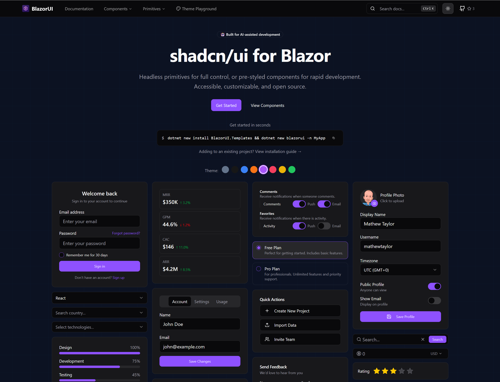

# Blazor Blueprint

[](https://blazorblueprintui.com)
[](https://github.com/blazorblueprintui/ui/stargazers)
[](https://www.nuget.org/packages/BlazorBlueprint.Components)
[](LICENSE)

Beautiful UI components for Blazor, built with accessibility in mind. Inspired by [shadcn/ui](https://ui.shadcn.com/).

<p align="center">
  <a href="https://blazorblueprintui.com">
    
  </a>
</p>

<p align="center">
  <a href="https://blazorblueprintui.com"><strong>Documentation</strong></a> ·
  <a href="https://blazorblueprintui.com/components"><strong>Components</strong></a> ·
  <a href="https://blazorblueprintui.com/primitives"><strong>Primitives</strong></a>
</p>

<p align="center">
  <strong>Styled Components</strong> · <strong>Headless Primitives</strong> · <strong>14 Chart Types</strong> · <strong>5,300+ Icons</strong>
</p>

## Table of Contents

- [Why Blazor Blueprint?](#why-blazor-blueprint)
- [What's New in v4](#whats-new-in-v4)
- [AI Integration](#ai-integration)
- [Getting Started](#getting-started)
- [Components](#components)
- [Primitives](#primitives)
- [Icons](#icons)
- [Theming](#theming)
- [Localization](#localization)
- [Architecture](#architecture)
- [Demo Applications](#demo-applications)
- [Contributing](#contributing)
- [License](#license)
- [Acknowledgments](#acknowledgments)

## Why Blazor Blueprint?

Blazor developers lack a modern, design-system-first UI library equivalent to what React developers have with shadcn/ui. Blazor Blueprint fills that gap — pre-built components and headless primitives that integrate directly with Tailwind and shadcn themes, targeting .NET 10 across Server, WebAssembly, and Auto render modes.

- **Zero Configuration** — Pre-built CSS included. No Tailwind setup, no Node.js, no build tools required.
- **Coexists with Your Tailwind** — Every utility in the prebuilt CSS is prefixed `bb:` and kept in its own cascade layer, so it never collides with your own Tailwind build.
- **Full shadcn/ui Theme Compatibility** — Use themes from [shadcn/ui](https://ui.shadcn.com/themes) or [tweakcn](https://tweakcn.com) directly.
- **Built with Accessibility in Mind** — Includes ARIA attributes, keyboard support, and semantic HTML structure.
- **Dark Mode Built-in** — Light and dark themes with CSS variables, ready out of the box.
- **Two-Layer Architecture** — Use pre-styled components for speed, or headless primitives for full control.

## What's New in v4

See the [changelog](CHANGELOG.md#2026-09-19) for the full list and the [migration guide](V4-MIGRATION-GUIDE.md) for breaking changes.

- **.NET 10 minimum** — Components, Primitives and icon packages target `net10.0`. v4 drops .NET 8 and .NET 9 support.
- **Right-to-left support** — Wrap the layout in `BbDirectionProvider` and the library mirrors for Arabic or Hebrew. Layout mirrors through logical CSS properties rather than through C#, a convention test keeps it that way, overlays inherit the direction across the portal boundary, and the components that place content with pixel maths read the direction at the moment of the gesture. Parameters that name a physical side — `SheetSide`, `ToastPosition` and the rest — keep their promise, by design. See the [Right-to-Left guide](demos/BlazorBlueprint.Demo.Shared/Pages/Guides/RtlGuide.razor).
- **Scheduler** — Day, Week, Monday–Friday WorkWeek and Month views, resource lanes, overlapping appointments, drag to move and resize either time boundary. All-day events draw as bars in a band above the time grid, and a multi-day run is one bar rather than a chip per day. `ActiveHours` mutes or refuses the parts of a day the schedule is not about. Recurring series support individual exceptions; IANA time zones include daylight-saving validation, and `TimeZones` lets you name your own. Derive from `SchedulerEvent` to carry your own fields into the editor, filter the visible resources, replace the toolbar, and right-click a slot or an appointment for a context menu.
- **DataGrid cell and batch editing** — Isolated drafts, validation, rejected-save recovery and keyboard save/cancel. Inline editors preserve column widths, support custom Bb input controls, and reapply sorting after accepted edits. Applications supply a deep-copy `EditItemFactory` and persistence callbacks.
- **Charts** — 14 types on Apache ECharts with a declarative composition API: Area, Bar, Candlestick, Funnel, Gauge, Heatmap, Line, Map, Pie, Radar, Radial Bar, Rose, Sankey and Scatter. Colours resolve from your theme's CSS variables at runtime and re-render on a theme change, and `OnDataPointClick` maps a click straight back to the position in the collection you bound.
- **Ten more components** — `BbChip` and `BbChipSet` for selectable, dismissible pills; `BbFab` for a screen's one main action; `BbStepper` and `BbStep` for progress through a sequence; `BbLink` for a link that sits on the text baseline; `BbHighlighter` to mark what matched a search; `BbImage` with a fallback for a source that will not load; `BbScrollToTop`; and `BbExitPrompt`, which holds a navigation while there is unsaved work.
- **Mobile components** — `BbAppBar`, `BbBottomNav`, `BbNotificationBadge`, `BbQuantityStepper` and `BbSectionHeader`, plus Drawer snap points with pointer and keyboard resizing, Select as a bottom sheet, and a DataView mobile toolbar that puts sorting and filters in one.
- **Reusable motion** — `BbMotion` presets and custom keyframes with viewport, hover, press and manual triggers; `BbHeightAnimation`, `BbSelectionIndicator`, `BbPageTransition` and `BbScreenTransition`. Animations honour a reduced-motion preference, cancel stale work, and keep prerendered content usable.
- **Theme presets and scoped appearance** — Density, font family, surface and menu options persist alongside colours and radius. `BbThemeScope` carries local settings across the portal boundary into floating overlays.
- **Segmented date and time entry** — `BbDateInput` and `BbTimeInput` with culture-aware segments, keyboard increments, nullable drafts, inclusive bounds, optional pickers and EditContext validation, each with a form-field wrapper.
- **TreeSelect and Cascader** — Searchable hierarchy selection with form bindings and keyboard navigation. TreeSelect supports cascading parent checkboxes and indeterminate states; Cascader reveals the selected path and scrolls to newly opened levels.
- **Menu families** — DropdownMenu, ContextMenu and Menubar gain shared submenu and radio-item families, and ContextMenu gains checkbox items, so the three stay consistent with each other.
- **FileUpload lifecycle** — Supply an `UploadHandler` for progress, cancellation and retry, with browser file references retained across selections.
- **Localizable throughout** — Every piece of component chrome reads from `IBbLocalizer`; the built-in English defaults cover all 546 strings.
- **Browser regression coverage** — A Playwright suite runs against Server, WebAssembly and Interactive Auto in Chromium and WebKit, covering keyboard navigation, mobile overlays, scoped themes, scheduler editing and Auto's hand-off to WebAssembly.

Try these features in the [source demos](#demo-applications).

## AI Integration

Blazor Blueprint ships with a built-in MCP server and llms.txt — so Claude, Cursor, Copilot, and Windsurf generate correct component code on the first try.

- **MCP Server** — 15 tools give your AI structured access to every component, primitive, blueprint, icon library, and the changelog.
- **llms.txt** — 180+ machine-optimized docs so any LLM can understand the library without hallucinating.
- **Works Everywhere** — Claude Code, Cursor, GitHub Copilot, Windsurf — any MCP-compatible AI tool.

```bash
# Claude Code
claude mcp add blazorblueprint --transport stdio -- npx -y @blazorblueprint/mcp

# Any other MCP client: run the server with
npx -y @blazorblueprint/mcp
```

Learn more at [blazorblueprintui.com](https://blazorblueprintui.com).

## Getting Started

### Requirements

v4 requires **.NET 10 or later** and an interactive Blazor render mode. Retarget .NET 8/9 applications before upgrading, and keep Components and Primitives on matching v4 versions. To build this branch, use the SDK specified in [global.json](global.json) (10.0.400 or a later .NET 10 feature band).

### Installation

```bash
# Styled components (includes Primitives)
dotnet add package BlazorBlueprint.Components

# Or just headless primitives for custom styling
dotnet add package BlazorBlueprint.Primitives
```

Optionally add an icon library:

```bash
dotnet add package BlazorBlueprint.Icons.Lucide       # 1,750+ icons
dotnet add package BlazorBlueprint.Icons.Heroicons    # 1,288 icons (4 variants)
dotnet add package BlazorBlueprint.Icons.Feather      # 286 icons
dotnet add package BlazorBlueprint.Icons.FontAwesome  # 2,066 icons (3 variants, includes brand logos)
```

Optionally add the PDF viewer, a package of its own because PDF.js is over 2 MB of script and WebAssembly. Its setup is in the [package README](src/BlazorBlueprint.PdfViewer/README.md):

```bash
dotnet add package BlazorBlueprint.PdfViewer
```

Upgrading from v3? Breaking changes and what to do about them are in [V4-MIGRATION-GUIDE.md](V4-MIGRATION-GUIDE.md).

### Project Template

The fastest way to start a new project:

```bash
dotnet new install BlazorBlueprint.Templates
dotnet new blazorblueprint -n MyApp
```

### Setup

**1. Register services** in `Program.cs`:

```csharp
builder.Services.AddBlazorBlueprintComponents();
```

**2. Add imports** to `_Imports.razor`:

```razor
@using BlazorBlueprint.Components
@using BlazorBlueprint.Primitives
```

**3. Add CSS** to your `App.razor` `<head>`:

```html
<!-- Your theme variables (optional) -->
<link rel="stylesheet" href="styles/theme.css" />
<!-- Blazor Blueprint styles -->
<link rel="stylesheet" href="_content/BlazorBlueprint.Components/blazorblueprint.css" />

<!-- Applies the saved theme before the first paint, so a dark-mode user never sees
     a flash of light. Must be a classic blocking script in <head>. See THEMING.md. -->
<script src="_content/BlazorBlueprint.Components/js/theme-init.js"></script>
```

If you also run your own Tailwind build, load its output before or after `blazorblueprint.css` — the library's utilities are prefixed `bb:`, so the two never define the same class. Do not `@source` the library from your Tailwind input; it is not needed. See [THEMING.md](THEMING.md).

**Blazor Server only — a themed reconnection dialog.** Give your host page an element with `id="components-reconnect-modal"` and Blazor drives it instead of building its own plain white overlay. The styling ships in `blazorblueprint.css` and reads your theme variables, so light and dark need no configuration. Copy the block from the [Reconnection guide](demos/BlazorBlueprint.Demo.Shared/Pages/Guides/ReconnectionGuide.razor) — it cannot be a Blazor component, because the dialog only appears once the circuit is already down.

**4. Add BbPortalHost** to your root layout (required for overlays like Dialog, Sheet, Popover):

```razor
@inherits LayoutComponentBase
@using BlazorBlueprint.Primitives

<div class="min-h-screen bg-background">
    @Body
</div>

<BbPortalHost />
```

> The `@using` matters even though step 2 adds it globally — keep it if you import per file instead
> (for example to avoid type-name clashes with another component library). Without `BbPortalHost` in
> scope Razor does not treat the tag as a component: it emits a literal `<bbportalhost>` element, with
> no build error, and every overlay silently fails to render. Adding `@rendermode` to it then fails
> with `RZ10023: Attribute '@rendermode' is only valid when used on a component`, which is the
> giveaway. In v3 the host lived in `BlazorBlueprint.Primitives.Services`; see the
> [v4 migration guide](V4-MIGRATION-GUIDE.md).

**5. Use components:**

```razor
<BbButton Variant="ButtonVariant.Default">Click me</BbButton>

<BbDialog>
    <BbDialogTrigger>
        <BbButton>Open Dialog</BbButton>
    </BbDialogTrigger>
    <BbDialogContent>
        <BbDialogHeader>
            <BbDialogTitle>Welcome</BbDialogTitle>
            <BbDialogDescription>
                Beautiful Blazor components inspired by shadcn/ui.
            </BbDialogDescription>
        </BbDialogHeader>
        <BbDialogFooter>
            <BbDialogClose>
                <BbButton Variant="ButtonVariant.Outline">Close</BbButton>
            </BbDialogClose>
        </BbDialogFooter>
    </BbDialogContent>
</BbDialog>
```

**6. Render modes** — Blazor Blueprint components handle user input and JavaScript interop, so they require an **interactive** render mode (`InteractiveServer`, `InteractiveWebAssembly`, or `InteractiveAuto`). The simplest setup is to enable interactivity globally on the router:

```razor
<!-- App.razor -->
<HeadOutlet @rendermode="InteractiveServer" />
<Routes @rendermode="InteractiveServer" />
```

> **Important:** A routed page's layout inherits the page's render mode. If you use *per-page* interactivity (e.g. because some auth pages must stay static for `HttpContext`), `MainLayout` renders statically — so buttons, theme toggles, and providers placed in it won't respond. In that case, render the interactive layout chrome (and `BbPortalHost` / `BbToastProvider` / `BbDialogProvider`) as interactive *islands* with `@rendermode`. See the [Render Modes guide](demos/BlazorBlueprint.Demo.Shared/Pages/Guides/RenderModesGuide.razor) for the full pattern.

## Components

Blazor Blueprint includes the styled component families below, with composable subcomponents and headless primitives. See the [changelog](CHANGELOG.md) for the additions and changes in each release.

### New in v4.1

Eight components, none of which takes a runtime dependency of its own.

| Component | What it is | Demo |
|-----------|------------|------|
| `BbQrCode` | A scannable code drawn as SVG, on a from-scratch ISO/IEC 18004 encoder: all 40 versions, four error-correction levels, numeric, alphanumeric and UTF-8 byte modes, module shapes and a centre logo. No JavaScript and no image request. | `/components/qr-code` |
| `BbBarcode` | Fourteen linear symbologies drawn as SVG, on encoders written in C#: Code 128, Code 39, EAN-13, EAN-8, UPC-A, ITF, Codabar, ISBN, ISSN, MSI, Telepen, Pharmacode, POSTNET and the Royal Mail 4-state code. Every symbol was checked bar for bar against zint and decoded back with zxing-cpp. | `/components/barcode` |
| `BbListBox` | An always-visible list of options: no trigger and no popover, with the full listbox keyboard pattern, search and range selection. | `/components/list-box` |
| `BbPickList` | Two lists and the buttons that move options between them, with reordering, search and keyboard support. Each pane is a `BbListBox`. | `/components/pick-list` |
| `BbSignature` | A signing field on the `BbSignaturePad` primitive: sign by drawing or by typing a name, with SVG, PNG and raw stroke output. | `/components/signature` |
| `BbPivotDataGrid` | A cross-tabulation whose columns come from the data: nested fields on both axes, subtotals and grand totals worked out from the items rather than the cells, custom aggregates, drill-down, a field picker and group-aware paging. | `/components/pivot-data-grid` |
| `BbGantt` | A plan against a timeline, with the task list and the bars in one table so a row cannot drift. Six zoom levels, summary roll-up, milestones, all four dependency types with routed arrows, drag to move, resize, set progress and draw a dependency, drag a row to reorder or re-parent, a hover card and a legend, non-working days, a today marker and right-to-left support. | `/components/gantt` |
| `BbMapChart` | A world choropleth for country-level data such as visitors or sales. Bind ISO country codes or English names to values, colour them on an automatic or custom scale with `BbVisualMap`, and turn on pan and zoom with `Roam`. A click reports the index in the collection you bound. The Natural Earth boundaries load only when a page draws a map. | `/charts/map` |

The QR and barcode symbols stay dark on a light field in both themes. A reader expects that, and enough of them refuse an inverted symbol that tracking a dark theme would trade a working code for a tidier page.

### New in v4

v4 adds **52 styled Razor components**: 26 primary controls and 26 composition helpers. The primary controls have **26 focused demo pages**, each with live examples, snippets, accessibility guidance and API references. Composition helpers are documented within their owning component's page. The component homepage, sidebar and command search share the same demo-page catalog; related pages are grouped consistently, and every menu link opens a distinct demo. The combined shopping example is a **[Mobile Shop recipe](demos/BlazorBlueprint.Demo.Shared/Pages/Recipes/MobileShopRecipe.razor)** at `/recipes/mobile-shop`.

Sidebar and homepage `v4` badges identify new components only; existing components keep their original status. API-reference badges identify individual properties, methods, enum values and supporting components added in v4. Both are measured against v3.17.

All names below include the `Bb` prefix in code. Generic type parameters are omitted from the inventory.

| Family | New components | Demo |
|--------|----------------|------|
| Segmented inputs (2) | `BbDateInput`, `BbTimeInput` | `/components/date-input`, `/components/time-input` |
| Form fields (5) | `BbFormFieldDateInput`, `BbFormFieldTimeInput`, `BbFormFieldTreeSelect`, `BbFormFieldCascader`, `BbFormFieldQuantityStepper` | `/components/form-field-date-input`, `/components/form-field-time-input`, `/components/form-field-tree-select`, `/components/form-field-cascader`, `/components/form-field-quantity-stepper` |
| Mobile (6) | `BbAppBar`, `BbBottomNav`, `BbBottomNavItem`, `BbNotificationBadge`, `BbQuantityStepper`, `BbSectionHeader` | `/components/app-bar`, `/components/bottom-nav`, `/components/notification-badge`, `/components/quantity-stepper`, `/components/section-header` |
| Motion (6) | `BbMotion`, `BbHeightAnimation`, `BbSelectionIndicator`, `BbPageTransition`, `BbScreenTransition`, `BbRenderStateProvider` | `/components/motion`, `/components/height-animation`, `/components/selection-indicator`, `/components/page-transition`, `/components/screen-transition`, `/components/render-state-provider` |
| Dropdown menu (5) | `BbDropdownMenuRadioGroup`, `BbDropdownMenuRadioItem`, `BbDropdownMenuSub`, `BbDropdownMenuSubTrigger`, `BbDropdownMenuSubContent` | `/components/dropdown-menu` |
| Context menu (6) | `BbContextMenuCheckboxItem`, `BbContextMenuRadioGroup`, `BbContextMenuRadioItem`, `BbContextMenuSub`, `BbContextMenuSubTrigger`, `BbContextMenuSubContent` | `/components/context-menu` |
| Menubar (5) | `BbMenubarRadioGroup`, `BbMenubarRadioItem`, `BbMenubarSub`, `BbMenubarSubTrigger`, `BbMenubarSubContent` | `/components/menubar` |
| Sidebar (4) | `BbSidebarPillNav`, `BbSidebarPillNavItem`, `BbSidebarPillInset`, `BbSidebarSelectionIndicator` | `/components/sidebar` |
| Chips (2) | `BbChip`, `BbChipSet` | `/components/chip` |
| Stepper (2) | `BbStepper`, `BbStep` | `/components/stepper` |
| Action (1) | `BbFab` | `/components/fab` |
| Text and page helpers (5) | `BbLink`, `BbHighlighter`, `BbImage`, `BbScrollToTop`, `BbExitPrompt` | `/components/link`, `/components/highlighter`, `/components/image`, `/components/scroll-to-top`, `/components/exit-prompt` |
| Other helpers (3) | `BbBadgeIcon`, `BbSortableHandle`, `BbThemeScope` | `/components/badge`, `/components/sortable`, `/components/theme` |

The Primitives package also gains six shared headless components used by the styled menu families: `BbMenuRadioGroup`, `BbMenuRadioItem`, `BbMenuSub`, `BbMenuSubTrigger`, `BbMenuSubContent`, and `BlazorBlueprint.Primitives.ContextMenu.BbContextMenuCheckboxItem`. They are supporting implementations, counted separately from the 52 styled components.

Existing components gain DataView selection/grouping/list virtualization and a mobile toolbar; MultiSelect footer/close; FilterBuilder presets/editors; Drawer snapping; Select bottom sheets; theme presets; richer Carousel controls; keyboard Sortable/drop permissions; and Badge, ToggleGroup and Separator variants. All additions remain open source.

**TreeSelect keyboard behavior:** with a tree node focused, **Space** expands or collapses its branch. **Enter** selects and closes in single-selection mode; in checkbox mode, Enter checks/unchecks the item and keeps the dropdown open. Space on a leaf does not change the selection. `LeafOnly` continues to limit selectable values.

### Mobile, Motion and Themes

| Component | Description |
|-----------|-------------|
| **App Bar / Bottom Navigation** | Safe-area navigation, title/back actions, active links and touch-sized controls |
| **Notification Badge / Section Header** | Accessible count/dot overlays and section headings with actions |
| **Motion** | Entrance/exit presets, custom keyframes, viewport/hover/press/manual triggers and reduced-motion handling |
| **Height Animation** | Expansion, collapse and automatic content resizing while retaining child state |
| **Selection Indicator** | Animated active, hover and keyboard-focus feedback |
| **Page / Screen Transition** | Incoming navigation and keyed screen animations with stable first renders |
| **Render State Provider** | Cascading prerender/interactive state |
| **Theme Scope** | Scoped density, typography, surfaces and menu appearance; floating overlays inherit the scope |

Theme presets, mobile DataView sorting/filtering, drawer snap points, carousel autoplay/drag controls and sidebar pill navigation extend their existing component families. Named fonts require application-provided font assets.

### Enterprise Components

Production-ready components for complex data-driven applications:

| Component | Description |
|-----------|-------------|
| **Dashboard Grid** | Drag-and-drop, resizable widget layout for composing dashboards. Built on CSS Grid with responsive breakpoints, state persistence, keyboard accessibility, and loading/empty states. |
| **Scheduler** | Day/week/work-week scheduling with Monday/Sunday week starts, configurable slots, resource lanes, drag/resize, event editing, confirmed deletion, recurrence and optional per-event IANA time zones |
| **Gantt** | A plan against a timeline: task list and bars in one table, six zoom levels, summary roll-up, milestones, all four dependency types with routed arrows, drag/resize/progress editing, dependency drawing, row drag to reorder and re-parent, hover cards, a legend, non-working days and a today marker. `GanttBuilder` is the same engine without markup. |
| **Pivot Data Grid** | Cross-tabulation whose columns come from the data: nested row and column fields, subtotals and grand totals worked out from the items rather than the cells, custom aggregates, drill-down, a field picker and group-aware paging. `PivotBuilder` is the same engine without markup. |
| **TreeSelect** | Searchable single/multiple hierarchy selection with cascading checkboxes, indeterminate states, leaf-only selection and form binding |
| **Cascader** | Hierarchy columns, path search, leaf/branch selection, keyboard/RTL navigation and automatic scrolling to the active level |
| **FileUpload** | Optional transport callback with progress, cancellation, retries and preserved browser files |
| **DataGrid** | Full-featured data grid with row/cell/batch editing, validation, multi-column sorting, per-column filtering, row grouping with aggregates, hierarchical tree data, row selection, expandable rows, virtualization, context menus, pinned columns, column reordering/resizing/visibility, and state persistence. Supports `IQueryable`, `IEnumerable`, and `ItemsProvider` data sources. |
| **Dynamic Form** | Schema-driven form rendering — define fields, validation rules, and layout in a schema object, and the component generates the complete form with appropriate inputs, conditional visibility, and error display. |
| **Filter Builder** | Visual query builder for constructing complex filter expressions with AND/OR logic, nested condition groups, and type-aware operators. Pairs with DataGrid for interactive data exploration. |
| **Form Wizard** | Multi-step form wizard with progress indicators, per-step validation, optional/skippable steps, and navigation controls. |
| **Chart** | 14 chart types (Area, Bar, Candlestick, Funnel, Gauge, Heatmap, Line, Map, Pie, Radar, Radial Bar, Rose, Sankey, Scatter) built on Apache ECharts with a declarative composition API and automatic theme integration. |
| **Dock** | IDE-style docking layout — drag-and-drop panels between regions, pinning, maximize, close/reopen, pop-out floating panels, and tab-strip overflow. |
| **Event Calendar** | Agenda/event calendar with Month, Week, and Agenda views, generic over your own event model, with per-event templates and styling. |
| **Rich Text Editor** | WYSIWYG editor on Quill 2 — headings, lists and checklists, links, images with an upload hook, tables, text colour and highlight, alignment, inline and block code, undo/redo — with sanitised HTML and Delta output. |
| **Markdown Editor** | Toolbar formatting with split-pane live preview. |

### Form & Input

| Component | Description |
|-----------|-------------|
| **Button** | Multiple variants (default, destructive, outline, secondary, ghost, link) with loading state and icon support |
| **Button Group** | Visually group related buttons with connected styling |
| **Calendar** | Interactive calendar with date constraints, range selection, and per-day templates/styling |
| **Checkbox** | Checkbox with indeterminate state and ARIA attributes |
| **Checkbox Group** | Group of checkboxes with select-all support |
| **Pick List** | Two lists and the buttons that move options between them, with reordering, search and keyboard support |
| **Color Picker** | Color selection with swatches and custom input |
| **Combobox** | Searchable autocomplete dropdown |
| **Currency Input** | Currency-formatted numeric input with locale support |
| **Date Input** | Culture-ordered date segments with keyboard editing, calendar access and EditForm draft validation |
| **Date Picker** | Date picker with popover calendar, optional manual text entry with configurable input formats, and formatting options |
| **Date Range Picker** | Dual-calendar range selection with quick-select presets and optional auto-apply |
| **Date Time Picker** | Combined date and time selection in one popover — calendar plus 12/24h time panel with optional seconds |
| **Dynamic Form** | Schema-driven form rendering — generates complete forms from a definition with automatic input selection, validation, conditional visibility, and layout customization |
| **Field** | Combines label, control, description, and error for structured forms |
| **Filter Builder** | Visual query builder for data filter expressions with AND/OR logic, condition groups, and two-way binding |
| **File Upload** | Drag-and-drop file selection with preview and optional upload progress, cancellation and retry |
| **Form Field Cascader** | Pre-configured cascader field with built-in label, description, and validation |
| **Form Field Checkbox** | Pre-configured checkbox field with built-in label, description, and validation |
| **Form Field Checkbox Group** | Pre-configured checkbox group field with built-in label, description, and manual validation |
| **Form Field Combobox** | Pre-configured combobox field with built-in label, description, and validation |
| **Form Field Currency Input** | Pre-configured currency input field with built-in label, description, and validation |
| **Form Field Date Input** | Pre-configured segmented date input field with built-in label, description, and validation |
| **Form Field Date Picker** | Pre-configured date picker field with built-in label, description, and validation |
| **Form Field Date Range Picker** | Pre-configured date range picker field with built-in label, description, and manual validation |
| **Form Field Date Time Picker** | Pre-configured date-time picker field with built-in label, description, and validation |
| **Form Field File Upload** | Pre-configured file upload field with built-in label, description, and manual validation |
| **Form Field Input** | Pre-configured input field with built-in label, description, and validation |
| **Form Field Input OTP** | Pre-configured OTP input field with built-in label, description, and validation |
| **Form Field Masked Input** | Pre-configured masked input field with built-in label, description, and validation |
| **Form Field MultiSelect** | Pre-configured multi-select field with built-in label, description, and validation |
| **Form Field Native Select** | Pre-configured native select field with built-in label, description, and validation |
| **Form Field Numeric Input** | Pre-configured numeric input field with built-in label, description, and validation |
| **Form Field Quantity Stepper** | Pre-configured quantity stepper field with built-in label, description, and validation |
| **Form Field RadioGroup** | Pre-configured radio group field with built-in label, description, and validation |
| **Form Field Select** | Pre-configured select field with built-in label, description, and validation |
| **Form Field Switch** | Pre-configured switch field with built-in label, description, and validation |
| **Form Field Tag Input** | Pre-configured tag input field with built-in label, description, and validation |
| **Form Field Textarea** | Pre-configured textarea field with built-in label, description, and validation |
| **Form Field Time Input** | Pre-configured segmented time input field with built-in label, description, and validation |
| **Form Field Time Picker** | Pre-configured time picker field with built-in label, description, and validation |
| **Form Field Tree Select** | Pre-configured tree select field with built-in label, description, and validation |
| **Form Wizard** | Multi-step form wizard with step navigation, progress indication, per-step validation, and optional/skippable steps |
| **Input** | Text input with multiple types and validation |
| **Input Field** | Typed input with automatic conversion, formatting, and validation for a dozen built-in types (numbers, dates, times, `Guid`, `bool`, `string`) and their nullable forms |
| **Input Group** | Enhanced inputs with icons, buttons, and addons |
| **Input OTP** | One-time password input with individual digit fields |
| **Label** | Form labels with control association |
| **List Box** | Always-visible list of options with the full listbox keyboard pattern, search, and single, multiple or range selection |
| **Masked Input** | Input with format masks (phone, SSN, etc.) |
| **MultiSelect** | Searchable multi-selection with tags, checkboxes, custom footer and programmatic close |
| **Native Select** | Browser-native select with consistent styling |
| **Numeric Input** | Numeric input with increment/decrement controls |
| **Radio Group** | Radio buttons with keyboard navigation |
| **Range Slider** | Dual-handle slider for selecting value ranges, horizontal or vertical |
| **Rating** | Star/icon rating input |
| **Select** | Keyboard-accessible selection with popover or bottom-sheet presentation |
| **Signature** | Signing field that captures a drawn or typed signature, with SVG, PNG and raw stroke output |
| **Slider** | Range input with drag support, horizontal or vertical |
| **Sortable** | Pointer and keyboard sortable lists/grids, connected-list transfer, move/drop permissions, reusable handles and custom drag previews |
| **Split Button** | Primary action with dropdown for secondary actions |
| **Switch** | Toggle switch with customizable thumb |
| **Tag Input** | Inline tag/chip input for managing string lists with suggestions, validation, and customizable triggers |
| **Textarea** | Multi-line text input with auto-sizing and character count |
| **Time Input** | Segmented 12/24-hour entry with optional seconds, bounds, picker and EditForm validation |
| **Quantity Stepper** | Touch-sized quantity editing with bounds and remove-at-minimum action |
| **Time Picker** | Time selection with hour/minute controls |
| **Toggle** | Two-state toggle button |
| **Toggle Group** | Single/multiple selection with required-selection and horizontal-scrolling options |

### Layout & Navigation

| Component | Description |
|-----------|-------------|
| **Accordion** | Collapsible content sections (single or multiple) |
| **Aspect Ratio** | Maintain width/height ratio for responsive content |
| **Breadcrumb** | Navigation trail with hierarchical location |
| **Card** | Container with header, content, footer, and action areas |
| **Carousel** | Responsive slide counts, gaps, autoplay/pause, dragging, indicators and slide-change callbacks |
| **Collapsible** | Expandable/collapsible panels |
| **Dock** | IDE-style docking layout with drag-and-drop panels, pinning, maximize, pop-out floating windows, and tab overflow |
| **Item** | Flexible list items with media, content, and actions |
| **Navigation Menu** | Horizontal navigation with dropdown menus |
| **Pagination** | Page navigation with first/previous/next/last controls and page size selection |
| **Resizable** | Resizable panels with drag handles |
| **Responsive Nav** | Adaptive navigation that switches between desktop and mobile layouts |
| **Scroll Area** | Custom scrollable area with styled scrollbars |
| **Separator** | Horizontal/vertical dividers with solid, dashed and dotted line styles |
| **Sidebar** | Responsive icon/pill collapse modes, animated navigation indicators, inset/floating variants and mobile sheets |
| **Tabs** | Tabbed interfaces with controlled/uncontrolled modes, and tabs the user can add, close, rename and reorder |
| **Timeline** | Vertical timeline with alignment, connector styles, loading states, and collapsible items |

### Overlay

| Component | Description |
|-----------|-------------|
| **Alert Dialog** | Modal requiring user acknowledgement |
| **Command** | Command palette with keyboard navigation, filtering, and dialog mode |
| **Context Menu** | Right-click menus with checkbox/radio items and nested submenus |
| **Dialog** | Modal dialogs with programmatic `DialogService` (alert, prompt, custom component dialogs) and an optional native `<dialog>` rendering strategy |
| **Drawer** | Sliding panels with pointer/keyboard snap points and optional drag dismissal |
| **Dropdown Menu** | Checkbox/radio choices and nested submenus with keyboard navigation |
| **Hover Card** | Rich hover previews |
| **Menubar** | Application menus with checkbox/radio choices and nested submenus |
| **Popover** | Floating content containers |
| **Sheet** | Slide-out panels (top, right, bottom, left) |
| **Toast** | Notification messages with multiple positions via `ToastService` |
| **Tooltip** | Contextual hover tooltips |

### Data & Content

| Component            | Description                                                                                                        |
|----------------------|--------------------------------------------------------------------------------------------------------------------|
| **Chart**            | 14 chart types (Area, Bar, Candlestick, Funnel, Gauge, Heatmap, Line, Map, Pie, Radar, Radial Bar, Rose, Sankey, Scatter) with theme integration |
| **Dashboard Grid**   | Drag-and-drop, resizable widget layout for dashboards with responsive breakpoints, state persistence, and keyboard accessibility |
| **DataGrid**         | Enterprise data grid with row/cell/batch editing, validation, sorting, per-column filtering, row grouping with aggregates, hierarchical tree data, selection, expandable rows, row virtualization, context menu, pinned columns, column reordering/resizing/visibility, and state persistence |
| **DataTable**        | Tables with sorting, filtering, pagination, and row selection                                                      |
| **DataView**         | Templated grid/list layouts, selection, grouping, list virtualization, mobile sorting/filtering, pagination and infinite scrolling |
| **Event Calendar**   | Month, Week, and Agenda views over your own event model with per-event templates, styling, and click callbacks    |
| **Gantt**            | Task list and timeline in one table, six zoom levels, summary roll-up, milestones, dependency arrows, drag/resize/progress editing, row reordering and re-parenting, and right-to-left support |
| **Markdown Editor**  | Toolbar formatting with live preview                                                                               |
| **Pivot Data Grid**  | Cross-tabulation with nested groups, totals worked out from the items, custom aggregates, drill-down and a field picker |
| **Rich Text Editor** | WYSIWYG editor on Quill 2 with headings, lists and checklists, links, images with an upload hook, tables, colour, alignment, code, and undo/redo |
| **Scheduler**        | Day/week/work-week appointments with resource lanes, configurable week starts and slots, drag/resize, recurring events and time-zone handling |
| **Tree View**        | Hierarchical data display with selection, checkboxes, lazy loading, drag-and-drop, search filtering, and data-driven or declarative modes |

### Display

| Component | Description |
|-----------|-------------|
| **Alert** | Callout messages with dismissible variants |
| **Avatar** | User avatars with fallback and group support |
| **Barcode** | Fourteen linear symbologies drawn as SVG on encoders written in C# — Code 128/39, EAN-13/8, UPC-A, ITF, Codabar, ISBN, ISSN, MSI, Telepen, Pharmacode, POSTNET and Royal Mail 4-state |
| **Badge** | Semantic/soft status variants and composable decorative icons |
| **Copy Text** | Click-to-copy text with tooltip feedback and copied-state indicator |
| **Dark Mode Toggle** | Button that toggles light/dark mode with customizable icons and optional label |
| **Empty** | Empty state placeholder with icon, title, and description |
| **Kbd** | Keyboard shortcut display |
| **Progress** | Progress bar indicator |
| **QR Code** | Scannable code drawn as SVG on a from-scratch ISO/IEC 18004 encoder — all 40 versions, four error-correction levels, module shapes and a centre logo |
| **Skeleton** | Loading placeholders |
| **Spinner** | Loading spinner with size variants |
| **Theme Switcher** | Theme customization popover — light/dark mode, independent base and primary colors, and radius, with persistence |
| **Typography** | Consistent text styling (H1–H4, paragraph, lead, muted, blockquote, inline code, etc.) |

### Chat & AI

Building blocks for chat and AI-agent interfaces:

| Component | Description |
|-----------|-------------|
| **Attachment** | File attachment chips with upload states (uploading, processing, error, done), previews, and actions |
| **Bubble** | Message bubbles with tinted/outlined variants, reactions, and attachment slots |
| **Marker** | Inline status and tool-call markers (e.g. "searching the web…") with an animated shimmer effect |
| **Message** | Chat message rows with avatar, content, and footer, aligned per role |

## Primitives

Blazor Blueprint's **35 headless primitives** provide behavior, ARIA attributes, and keyboard support without any styling. They handle all the complex interaction logic — focus trapping, ARIA attributes, keyboard shortcuts, portal rendering — while giving you complete control over appearance.

Use primitives when you need full design freedom or are building a custom design system.

| Primitive | What it handles |
|-----------|----------------|
| **Accordion** | Expand/collapse logic, single/multiple mode, keyboard navigation |
| **Alert Dialog** | Modal requiring explicit acknowledgement, no dismiss via overlay or Escape |
| **Barcode** | Fourteen linear symbology encoders, each with its own alphabet, length rule and check digit, producing bar geometry rather than pixels |
| **Checkbox** | Checked/unchecked/indeterminate state, ARIA attributes |
| **Collapsible** | Open/close state, animated transitions |
| **Context Menu** | Right-click menu with keyboard navigation and positioning |
| **Dashboard Grid** | Widget layout state, drag-and-drop coordination, resize handling, responsive breakpoints |
| **DataGrid** | Headless data grid with sorting, filtering, pagination, selection, expansion, row grouping, and state management |
| **Dialog** | Focus trapping, escape to close, scroll locking, portal rendering |
| **Direction** | Writing direction for everything inside it, cascaded as a context and written as a `dir` attribute |
| **Dropdown Menu** | Open/close, keyboard navigation, click-outside dismissal |
| **Gantt** | Task tree, summary roll-up, the timeline's two tiers and dependencies resolved against the rows on screen, with no markup |
| **Hover Card** | Hover intent, delay timing, portal positioning |
| **Label** | Label-control association |
| **Menubar** | Application-style menu bar with roving focus, submenus and typeahead |
| **Navigation Menu** | Site navigation with hoverable panels, pointer intent and keyboard access |
| **Pivot** | Cross-tabulation: nested headings on both axes, and totals worked out from the items rather than from the cells |
| **Popover** | Floating positioning, portal rendering, click-outside |
| **Progress** | Accessible progress bar with determinate and indeterminate states |
| **QR Code** | The whole of ISO/IEC 18004: every version and error-correction level, Reed-Solomon over GF(256), block interleaving and the eight masks, producing a module matrix |
| **Radio Group** | Single selection, arrow key navigation, ARIA roles |
| **Scroll Area** | Custom scrollbar with accessible ARIA scrollbar role and drag support |
| **Select** | Dropdown behavior, typeahead, keyboard navigation |
| **Separator** | Semantic or decorative divider with orientation support |
| **Sheet** | Side panel, focus trapping, scroll locking |
| **Signature Pad** | Stroke capture from pointer, touch or stylus, keeping the raw points behind a signature |
| **Slider** | Range input with keyboard navigation and pointer drag support |
| **Sortable** | Drag-and-drop sortable lists with SortableJS interop, ARIA live announcements, and connected multi-list support |
| **Swipe Area** | Swipe gestures with a distance threshold, an axis to judge them on, and pointer capture so a swipe off the edge still counts |
| **Switch** | Toggle state, keyboard support, ARIA switch role |
| **Table** | Sorting, pagination, row selection, keyboard row navigation |
| **Tabs** | Tab selection, arrow key navigation, ARIA tab roles |
| **Toggle** | Pressed/active state with aria-pressed support |
| **Tooltip** | Hover/focus triggers, delay, portal positioning |
| **Tree View** | Hierarchical expand/collapse, selection, checkbox state management |

Primitives are completely unstyled — bring your own CSS, Tailwind classes, or inline styles:

```razor
<BbAccordion class="my-accordion">
    <BbAccordionItem Value="item-1">
        <BbAccordionTrigger class="my-trigger">Section One</BbAccordionTrigger>
        <BbAccordionContent class="my-content">Content here.</BbAccordionContent>
    </BbAccordionItem>
</BbAccordion>
```

## Icons

Four icon library packages with **5,300+ total icons**:

| Package | Icons | Style | License |
|---------|-------|-------|---------|
| `BlazorBlueprint.Icons.Lucide` | 1,750+ | Stroke-based, consistent 24x24 | ISC; MIT for Feather-derived icons |
| `BlazorBlueprint.Icons.Heroicons` | 1,288 | 4 variants (Outline, Solid, Mini, Micro) of ~320 icons | MIT |
| `BlazorBlueprint.Icons.Feather` | 286 | Minimalist, stroke-based 24x24 | MIT |
| `BlazorBlueprint.Icons.FontAwesome` | 2,066 | 3 variants (1,407 Solid, 164 Regular, 495 Brands — includes brand logos) | CC BY 4.0 (SVG artwork); MIT (C# wrapper) |

## Theming

Blazor Blueprint is **100% compatible with shadcn/ui themes**. Use any theme from [shadcn/ui](https://ui.shadcn.com/themes) or [tweakcn](https://tweakcn.com) — copy the CSS variables into your `theme.css`:

```css
@layer base {
  :root {
    --background: oklch(1 0 0);
    --foreground: oklch(0.1450 0 0);
    --primary: oklch(0.2050 0 0);
    --primary-foreground: oklch(0.9850 0 0);
    /* ... */
  }

  .dark {
    --background: oklch(0.1450 0 0);
    --foreground: oklch(0.9850 0 0);
    --primary: oklch(0.9220 0 0);
    --primary-foreground: oklch(0.2050 0 0);
    /* ... */
  }
}
```

Load your theme **before** `blazorblueprint.css` so the variables are defined when referenced.

### Supported Variables

- **Colors** — `--background`, `--foreground`, `--primary`, `--secondary`, `--accent`, `--destructive`, `--muted`, and their foreground variants
- **Typography** — `--font-sans`, `--font-serif`, `--font-mono`
- **Layout** — `--radius`, `--shadow-*`
- **Charts** — `--chart-1` through `--chart-5`
- **Sidebar** — `--sidebar`, `--sidebar-primary`, `--sidebar-accent`, and variants

### Dark Mode

Apply the `.dark` class to your `<html>` element. All components automatically switch to dark mode colors.

## Localization

All component chrome strings (button labels, placeholders, ARIA labels, status messages) are localizable via the `IBbLocalizer` interface. The built-in `DefaultBbLocalizer` provides English defaults for all 546 strings.

### Quick Start

Subclass `DefaultBbLocalizer` to integrate with your localization strategy:

```csharp
public class AppLocalizer : DefaultBbLocalizer
{
    private readonly IStringLocalizer<SharedResources> localizer;

    public AppLocalizer(IStringLocalizer<SharedResources> localizer)
    {
        this.localizer = localizer;
    }

    public override string this[string key] => localizer[key] ?? base[key];
}

// Register in Program.cs
builder.Services.AddSingleton<IBbLocalizer, AppLocalizer>();
```

Components use string-key lookup (e.g., `Localizer["DataGrid.Loading"]`) with `string.Format` for parameterized strings. Calendar, DatePicker, DateRangePicker, and NumericInput automatically adapt to `CultureInfo.CurrentCulture` for date/number formatting.

## Architecture

Blazor Blueprint uses a **two-layer architecture** inspired by [Radix UI](https://www.radix-ui.com/):

```
BlazorBlueprint.Components     ← Pre-styled, ready to use
    ↓ builds on
BlazorBlueprint.Primitives     ← Headless, includes ARIA attributes and keyboard support
```

**Components** ship pre-built CSS matching the shadcn/ui design system. No Tailwind setup required — just reference the stylesheet and optionally provide theme variables.

Every utility in that stylesheet is prefixed `bb:` and kept in its own cascade layer, so it coexists with your own Tailwind build: your classes and the library's can never share a name, and a `Class="p-6"` you pass to a component still replaces the library's padding. Do not `@source` the library from your Tailwind input; it is not needed.

**Primitives** are completely unstyled. They include ARIA attributes, focus management, and keyboard support for complex interaction patterns, giving you full control over appearance.

### Services

Services are registered via dependency injection:

- `AddBlazorBlueprintComponents()` — registers everything (Components + Primitives)
- `AddBlazorBlueprintPrimitives()` — registers only Primitives services

Key services include `IPortalService` (overlay rendering), `IFocusManager` (focus trapping), `IPositioningService` (floating element positioning), `IKeyboardShortcutService` (global shortcuts), `DialogService` (programmatic dialogs), `ToastService` (notifications), and `IBbLocalizer` (localization).

## Demo Applications

Demo applications are included for all three Blazor hosting models:

```bash
dotnet run --project demos/BlazorBlueprint.Demo.Server  # http://localhost:7172
dotnet run --project demos/BlazorBlueprint.Demo.Wasm    # http://localhost:7173
dotnet run --project demos/BlazorBlueprint.Demo.Auto    # http://localhost:7174
```

The demos share a common Razor Class Library (`BlazorBlueprint.Demo.Shared`) with thin hosting projects per render mode, demonstrating that components work identically across Server, WebAssembly, and Auto.

Browse `/components` for the full catalog. The v4 examples include:

| Demo | Route | Examples |
|------|-------|----------|
| [DataGrid editing](demos/BlazorBlueprint.Demo.Shared/Pages/Components/DataGridEditingDemo.razor) | `/components/datagrid-editing` | Cell/batch editing, text/number/date/select/checkbox editors, validation and sorting after saves |
| [Scheduler](demos/BlazorBlueprint.Demo.Shared/Pages/Components/SchedulerDemo.razor) | `/components/scheduler` | Full-day scrolling with an initial visible hour, week starts, work weeks, dragging/resizing, slot sizes, recurrence, resources and time zones |
| [TreeSelect](demos/BlazorBlueprint.Demo.Shared/Pages/Components/TreeSelectDemo.razor) | `/components/tree-select` | Single/multiple selection, cascading checkboxes, leaf-only values, Space expansion and Enter selection |
| [Cascader](demos/BlazorBlueprint.Demo.Shared/Pages/Components/CascaderDemo.razor) | `/components/cascader` | Path search, branch selection, keyboard navigation and scrolling between levels |
| [FileUpload](demos/BlazorBlueprint.Demo.Shared/Pages/Components/FileUploadDemo.razor) | `/components/file-upload` | Upload progress, cancellation, retry and failure recovery |

The demos include code examples and API references. Rebuild after changing source files; these hosts do not support hot reload.

## Contributing

See [CONTRIBUTING.md](CONTRIBUTING.md) for development setup and guidelines.

## License

The Components and Primitives libraries are licensed under the [Apache License 2.0](LICENSE). The icon packages' C# wrappers are MIT licensed; their icon artwork retains its upstream licenses, listed below.

Distributions of the Apache-licensed libraries must retain the applicable contents of the [NOTICE](NOTICE) file.

NuGet packages include the applicable library license and third-party notices. Notices for bundled browser assets are also served at `_content/BlazorBlueprint.Components/THIRD-PARTY-NOTICES.txt` and `_content/BlazorBlueprint.Primitives/THIRD-PARTY-NOTICES.txt`.

Package-specific notices: [Components](src/BlazorBlueprint.Components/wwwroot/THIRD-PARTY-NOTICES.txt), [Primitives](src/BlazorBlueprint.Primitives/wwwroot/THIRD-PARTY-NOTICES.txt), [Lucide](src/BlazorBlueprint.Icons.Lucide/THIRD-PARTY-NOTICES.txt), [Heroicons](src/BlazorBlueprint.Icons.Heroicons/THIRD-PARTY-NOTICES.txt), [Feather](src/BlazorBlueprint.Icons.Feather/THIRD-PARTY-NOTICES.txt), and [Font Awesome](src/BlazorBlueprint.Icons.FontAwesome/THIRD-PARTY-NOTICES.txt).

## Acknowledgments

Blazor Blueprint implements components in Blazor and C#, drawing on the design of [shadcn/ui](https://ui.shadcn.com/) and the interaction principles of [Radix UI](https://www.radix-ui.com/). We thank the following projects and contributors for their designs, libraries, and assets.

**Design and platform**

- [shadcn/ui](https://ui.shadcn.com/) — Component design inspiration; [MIT License](https://github.com/shadcn-ui/ui/blob/main/LICENSE.md), Copyright (c) 2023 shadcn.
- [Radix UI](https://www.radix-ui.com/) — Headless component and interaction design inspiration; [MIT License](https://github.com/radix-ui/primitives/blob/main/LICENSE), Copyright (c) 2022 WorkOS.
- [ASP.NET Core / Blazor](https://github.com/dotnet/aspnetcore) — Component framework; MIT License, .NET Foundation and contributors.

**Libraries**

- [Tailwind CSS](https://tailwindcss.com/) — Utility CSS framework used to build the stylesheets; MIT License, Tailwind Labs.
- [tw-animate-css](https://github.com/Wombosvideo/tw-animate-css) — Bundled CSS animation utilities; MIT License.
- [TailwindMerge.NET](https://github.com/desmondinho/tailwind-merge-dotnet) — CSS class conflict resolution; MIT License. A C# adaptation of [tailwind-merge](https://github.com/dcastil/tailwind-merge).
- [Floating UI](https://floating-ui.com/) — Bundled positioning engine for floating elements; MIT License.
- [Apache ECharts](https://echarts.apache.org/) — Bundled charting engine; Apache License 2.0.
- [SortableJS](https://sortablejs.github.io/Sortable/) — Bundled drag-and-drop sorting library; MIT License.
- [Quill](https://quilljs.com/) — Bundled rich text editing engine; BSD 3-Clause License.
- [Markdig](https://github.com/xoofx/markdig) — Markdown parsing and HTML rendering; BSD 2-Clause License.
- [HtmlSanitizer](https://github.com/mganss/HtmlSanitizer) — HTML sanitization for the rich text and Markdown editors; MIT License.

**Map data**

- [Natural Earth](https://www.naturalearthdata.com/) — World map boundaries for `BbMapChart`, derived from Natural Earth v5.1.2; public domain.

**Icons**

- [Lucide Icons](https://lucide.dev/) — [ISC License, with MIT terms for Feather-derived icons](https://github.com/lucide-icons/lucide/blob/main/LICENSE); Lucide contributors and Cole Bemis.
- [Heroicons](https://heroicons.com/) — MIT License, Tailwind Labs.
- [Feather Icons](https://feathericons.com/) — MIT License, Cole Bemis.
- [Font Awesome Free](https://fontawesome.com/) — SVG icon artwork under [CC BY 4.0](https://fontawesome.com/license/free), Fonticons, Inc. The Blazor C# wrapper is MIT licensed; this package does not include Font Awesome font files.
- [Iconify](https://iconify.design/) — JSON icon datasets used to generate the C# icon collections; each collection retains its upstream icon license.

**Demo photography**

- [Unsplash](https://unsplash.com/) and its contributing photographers — Photos used in the demo applications, under the [Unsplash License](https://unsplash.com/license).
